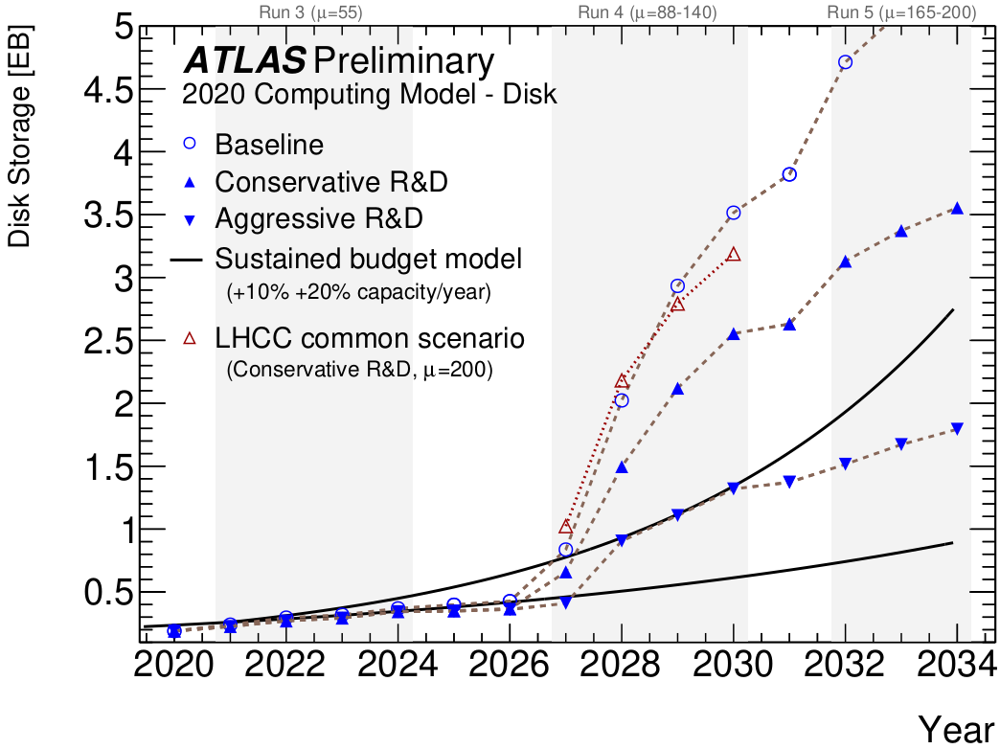

# Introduction
At the ATLAS experiment, the projected data production in 2032 will be 6 times larger than the storage available for the given budget.

<!---")--->

<figure class="image">
  
  <figcaption> Expected data storage need as a function of expected data storage available for the ATLAS experiment. Source: http://cds.cern.ch/record/2729668/files/</figcaption>
</figure>

This is issue is not unique to the ATLAS experiment. Storing and sharing increasingly large datasets is a challenge across disciplines in scientific research and industry. It is easy to say that there is a high demand, inside and outside particle physics, to effectively compress data more than conventional loss-less methods do

# Lossy Compression
Lossless compression preserves data in its entirety but as a consequence the amount of data reduction is limited. Lossy compression on the other hand, allow greater data reduction at the cost of some data loss.

However, in the same way as the MP3 compression uses Fourier transformation and psychoacoustics to specifically compress audio. A good lossy compression method for scientific data needs to be tailored to the data.

We introduce Baler, a tool that uses machine learning to derive a compression compression that is tailored to the user's input data, achieving large data reduction and high fidelity where it matters.

# Baler
The Baler project is a collaboration between 12 research physicists, computer scientists, and machine learning experts at the universities of Lund, Manchester, and Uppsala. Baler has already been used to compress scientific research data showing impressive performance.

Figure 1 shows a fluid dynamics simulation of a liquid flowing over a static cube. On the left is the original simulation, in the middle is what Baler reconstructs from a file compressed to 0.5% the original size, and on the right is the difference between the two

<figure class="image">
  
  <figcaption> Figure 1, comparison of a fluid dynamics simulation before and after compression down to 0.5% the original size.</figcaption>
</figure>

Figure 2 shows the distribution of a variable form reconstructed proton collisions at the Large Hardon Collider. It is shown that the original variable distribution is retained after a compression to 58% the original size, and the point-wise relative difference is small.

<figure class="image">
  
  <figcaption> Figure 2, proton collision variable distribution and relative difference before and after compression to 50% original size.</figcaption>
</figure>

<!--  -->
<!--  -->

Baler has been featured at the [26th International Conference on Computing in High Energy \& Nuclear Physics](indico.jlab.org/event/459/contributions/11723/attachments/9295/13647/Baler\_v2.pdf) -- the largest computing conference of its kind. The Baler tool is documented in a [scientific paper](arxiv.org/pdf/2305.02283.pdf) and is developed and maintained as an open-source project on [GitHub](https://github.com/baler-collaboration/baler). Baler is also part of the [Docker-Sponsored Open Source program](hub.docker.com/r/balercollaboration/baler).

# Future Work
Given Baler's huge potential in industry we now seek industry partners which want to collaborate with us and explore how machine learning based data compression can help improve their business. From the Baler team, we can contribute with person-power in the form of master student projects, internships, or post-doc positions. All we need is the data you want to explore and a contact person.